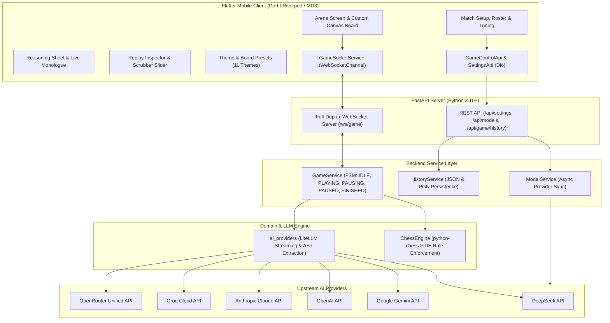

# ⚔️ AI Chess Arena

[](https://www.python.org/)
[](https://fastapi.tiangolo.com/)
[](https://flutter.dev/)
[](https://dart.dev/)
[](https://m3.material.io/)
[](LICENSE)

An autonomous multi-LLM chess battleground and real-time reasoning visualizer. Frontier AI models (**Claude 3.7 Sonnet**, **DeepSeek R1 / V4**, **Google Gemini 2.5**, **OpenAI o1 / o3-mini / GPT-4o**, **Groq**, and **OpenRouter**) duel each other under strict FIDE rules while streaming their inner **chain-of-thought tactical reasoning live** to a cross-platform Flutter client (**AI Chess Arena**).

---

## 🌟 Key Features

### 1. 🧠 Live Inner Monologue & Reasoning Stream
- **Token-by-Token Live Streaming**: Watch models calculate candidate lines, evaluate tactical threats, and decide on moves character-by-character.
- **Dual View Modes**:
  - **Live Terminal**: Real-time terminal output with cursor animation and auto-scrolling.
  - **Chat Monologue**: Conversational thought bubbles separating White and Black calculations with move timing and token metrics.
- **Dynamic Headroom Formula**: Dynamic allocation (`base_tokens + thinking_budget`) prevents mid-stream reasoning truncation.

### 2. ⚔️ Multi-LLM Combat Roster & Dynamic Tuning
- Pit any model against another (e.g. *Claude 3.7 Sonnet vs DeepSeek R1*, *Gemini 2.5 Flash vs GPT-4o*, or mirror matches).
- **Thinking Effort Chips**: Quick toggles (`Off`, `Low +1k`, `Med +4k`, `High +16k`).
- **Tactical Match Controls**: Start, Graceful Pause (completes active turn), Resume with altered parameters, Step (play 1 ply), and Reset.
- **Custom System Instructions**: Inject custom personas (e.g. Aggressive Attacker Tal, Positional Karpov, Trash Talker, Hyper-Defensive).

### 3. 🎨 Custom Canvas Chessboard & Material 3 Theming
- **Custom Canvas Renderer**: High-performance piece rendering with drag-and-drop previews, square highlights, check indicators, and board flip toggle.
- **11 System Themes**: True **OLED Pitch Black**, Pure Crisp Light, Catppuccin Mocha, Catppuccin Latte, Dracula Gothic, Nordic Frost, Gruvbox Retro, Rosé Pine, Emerald Matrix, Tokyo Night, and Modern Slate.
- **6 Chessboard Colorways**: Modern Slate, Emerald Green, Classic Wood, Midnight Ocean, Royal Purple, and OLED Obsidian.
- **Live Material Evaluation Bar**: Visual balance-of-power indicator tracking material differential with check alerts and victory confetti.

### 4. ⏪ Offline Match Replay Inspector & Scrubber
- **Tactical Scrubber Slider**: Step forward/back or auto-play through recorded matches with an adjustable pace slider (**0.5s to 20.0s per ply**).
- **Historical Snapshot**: Review the exact model parameters, temperature, thinking budget, and thoughts generated at every ply.
- **PGN Sharing**: Copy standard `.pgn` files complete with embedded reasoning comments directly to clipboard.

### 5. ⚡ Real-Time Auto-Sync & Token Economy Controls
- **Zero-Config Catalog Discovery**: Live vendor endpoints auto-sync active models into your roster on key validation.
- **Context Optimization**: Trim move history context windows (Full, Last 6, 10, 15, 20 moves) and toggle 8x8 ASCII board visual diagrams to conserve tokens.

---

## 🛠️ Technology Stack

| Layer | Technology | Purpose |
|---|---|---|
| **Backend Framework** | [FastAPI](https://fastapi.tiangolo.com/) (Python 3.10+) | High-throughput asynchronous REST API and full-duplex WebSocket server. |
| **Chess Engine** | [python-chess](https://python-chess.readthedocs.io/) | FIDE rule enforcement, legal move generation, SAN/UCI parsing, PGN serialization. |
| **LLM Orchestration** | [LiteLLM](https://docs.litellm.ai/) & Async HTTP | Streaming multi-provider completion calls with dynamic headroom token allocation. |
| **Mobile SDK** | [Flutter 3.x](https://flutter.dev/) & [Dart 3.x](https://dart.dev/) | Cross-platform native compilation for Android, iOS, and desktop. |
| **State Management** | [Riverpod 2.x](https://riverpod.dev/) (`riverpod_generator`) | Stream providers, fine-grained selector rebuilds, and singleton socket lifecycle. |
| **Mobile Networking** | [Dio](https://pub.dev/packages/dio) & [web_socket_channel](https://pub.dev/packages/web_socket_channel) | HTTP interceptors, timeouts, and reactive WebSocket streams. |
| **Mobile Navigation** | [GoRouter](https://pub.dev/packages/go_router) | Declarative routing with `StatefulShellRoute` preserving bottom-bar tab state. |
| **Serialization** | [Freezed](https://pub.dev/packages/freezed) & [json_serializable](https://pub.dev/packages/json_serializable) | Immutable state unions matching backend Pydantic schemas 1:1. |
| **Board Rendering** | Flutter `CustomPainter` | 60 FPS piece positioning, check glow effects, and square highlighting. |

---

## 🏗️ System Architecture



---

## ⚡ Mobile State Management & Real-Time Stream Flow

The mobile architecture solves the challenge of a **single continuous WebSocket stream feeding multiple independent UI regions** (chessboard, player HUD, live token monologue, move history table) without causing full-screen rebuilds:

```
GameSocketService (WS)
   │  raw JSON frames
   ▼
WsEvent (Freezed sealed union)
   │
   ├─► game_socket_provider (StreamProvider<WsEvent> kept alive at app root)
   │      │
   │      ├─► game_state_provider (derives current GameState: FEN, turn, captures, material diff)
   │      │
   │      ├─► thinking_stream_provider (buffers thinking_chunk tokens per ply)
   │      │
   │      └─► match_controls_provider (dispatches REST actions & reconciles optimistic UI)
```

### 🔌 Networking & Reliability Protocols
- **Heartbeat Watchdog**: Background timer sends `{"action":"ping"}` every 15s to maintain mobile carrier NAT bindings and detect drops.
- **Exponential Backoff**: Automatic reconnection on drop or app foregrounding (1s → 2s → 4s → capped at 15s) with snapshot request on reconnect.
- **Error Sanitization**: Provider quota or authentication errors are mapped to user-friendly banners and prevented from leaking into the thinking stream.

---

## 🎨 Design System & Colorway Matrix

### 11 Material 3 UI Theme Palettes

| Theme Preset | Background | Surface | Text Color | Primary Accent | Style / Inspiration |
|---|---|---|---|---|---|
| **Pure Crisp Light** | `#FFFFFF` | `#F5F5F5` | `#111111` | `#2563EB` | Clean Modern Light |
| **Modern Slate** | `#1E2227` | `#282C34` | `#E6E6E6` | `#61AFEF` | OneDark Slate |
| **OLED Pitch Black** | `#000000` | `#0A0A0A` | `#EDEDED` | `#3B82F6` | True OLED Pure Black |
| **Catppuccin Mocha** | `#1E1E2E` | `#313244` | `#CDD6F4` | `#89B4FA` | [Catppuccin Mocha](https://catppuccin.com/palette) |
| **Catppuccin Latte** | `#EFF1F5` | `#E6E9EF` | `#4C4F69` | `#1E66F5` | [Catppuccin Latte](https://catppuccin.com/palette) |
| **Dracula Gothic** | `#282A36` | `#44475A` | `#F8F8F2` | `#BD93F9` | [Dracula Theme](https://draculatheme.com/) |
| **Nordic Frost** | `#2E3440` | `#3B4252` | `#ECEFF4` | `#88C0D0` | [Nordic Palette](https://www.nordtheme.com/) |
| **Gruvbox Retro** | `#282828` | `#3C3836` | `#EBDBB2` | `#FE8019` | [Gruvbox](https://github.com/morhetz/gruvbox) |
| **Rosé Pine** | `#191724` | `#1F1D2E` | `#E0DEF4` | `#EBBCBA` | [Rosé Pine](https://rosepinetheme.com/) |
| **Emerald Matrix** | `#0D1F17` | `#132A1E` | `#D6F5E3` | `#10B981` | Cyberpunk Emerald |
| **Tokyo Night** | `#1A1B26` | `#24283B` | `#C0CAF5` | `#7AA2F7` | [Tokyo Night](https://github.com/enkia/tokyo-night-vscode-theme) |

### 6 Chessboard Colorways

| Board Theme | Light Square | Dark Square | Move Highlight | Check Glow |
|---|---|---|---|---|
| **Modern Slate** | `#EBEDF0` | `#7D8590` | `#F6F669` | `#FF6B6B` |
| **Emerald Green** | `#EEEED2` | `#769656` | `#F6F669` | `#FF4136` |
| **Classic Wood** | `#F0D9B5` | `#B58863` | `#CDD26A` | `#D9534F` |
| **Midnight Ocean** | `#DDE6ED` | `#27496D` | `#F6F669` | `#FF6363` |
| **Royal Purple** | `#E8E3F0` | `#6B4E9E` | `#F6D96B` | `#FF5C5C` |
| **OLED Obsidian** | `#3A3A3A` | `#0F0F0F` | `#E6C200` | `#E63946` |

---

## 🚀 Getting Started

### Prerequisites
Before running the application, make sure you have:
- **Python 3.10+** ([Download Python](https://www.python.org/downloads/))
- **Flutter 3.24+ & Dart 3+** ([Install Flutter](https://docs.flutter.dev/get-started/install))
- **Git** ([Download Git](https://git-scm.com/))

---

### 1. Backend Server Setup

#### Step 1: Create and activate virtual environment
**On Linux / macOS:**
```bash
cd backend
python3 -m venv .venv
source .venv/bin/activate
pip install -r requirements.txt
```

**On Windows (PowerShell):**
```powershell
cd backend
python -m venv .venv
.\.venv\Scripts\Activate.ps1
pip install -r requirements.txt
```

#### Step 2: Start the FastAPI backend
```bash
python run_server.py
```
- **REST API Docs**: `http://127.0.0.1:8000/docs`
- **WebSocket Stream**: `ws://127.0.0.1:8000/ws/game`

> **Quick Start (Windows)**: Double-click [run.bat](file:///home/niraj/Workspace/Persnoal/LLM-Chess/run.bat) to install requirements and start the backend.

---

### 2. Flutter Mobile Setup

In a new terminal window:

```bash
cd mobile
flutter pub get
```

#### Run on Connected Device / Emulator:
```bash
# List available devices (Android, iOS, Linux desktop, etc.)
flutter devices

# Run on your target device
flutter run
```

> **Network Configuration Note**:
> - If running on an **Android Emulator**, the default API endpoint `http://10.0.2.2:8000` is pre-configured.
> - If running on a **Physical Phone**, navigate to **Settings > Application Settings** inside the app and enter your host machine's local IP address (e.g. `http://192.168.1.50:8000`).

---

## 🔑 API Key Configuration

Open the **Settings** screen in the mobile app to configure your AI provider credentials:
- **Google Gemini**: [Google AI Studio](https://aistudio.google.com/)
- **DeepSeek**: [DeepSeek Platform](https://platform.deepseek.com/)
- **OpenAI**: [OpenAI Platform](https://platform.openai.com/)
- **Anthropic Claude**: [Anthropic Console](https://console.anthropic.com/)
- **Groq Cloud**: [Groq Console](https://console.groq.com/)
- **OpenRouter**: [OpenRouter Dashboard](https://openrouter.ai/)

> **Security Note**: All keys are stored securely in `backend/data/settings.json` (git-ignored) or loaded via a `.env` file (see `.env.example`). Keys are masked in responses and never exposed in plaintext.

---

## 🧪 Automated Testing & Verification

### Run Backend Tests:
```bash
cd backend
PYTHONPATH=. .venv/bin/pytest tests
```

### Run Flutter Analysis & Widget Tests:
```bash
cd mobile
flutter analyze
flutter test
```

---

## 📂 Project Directory Structure

```
AI-Chess-Arena/
├── backend/                          # Python FastAPI REST & WebSocket server
│   ├── app/
│   │   ├── core/
│   │   │   ├── chess_engine.py       # python-chess FIDE validator & PGN generator
│   │   │   └── config.py             # Settings loader, key masking & defaults
│   │   ├── models/
│   │   │   ├── ai_providers.py       # LiteLLM streaming & headroom formulas
│   │   │   └── schemas.py            # Pydantic schemas & state models
│   │   ├── prompts/
│   │   │   └── chess_prompts.py      # System & turn prompts
│   │   ├── services/
│   │   │   ├── game_service.py       # State machine, game loop & WebSocket broadcast
│   │   │   ├── history_service.py    # Game archive & disk persistence
│   │   │   └── model_service.py      # Live provider catalog auto-sync
│   │   ├── main.py                   # FastAPI server, REST & WebSocket routes
│   │   └── MODEL_SYNC_SPECS.md       # Provider specifications & protocols
│   ├── data/
│   │   ├── games/                    # Saved match JSONs and PGNs
│   │   └── settings.json             # Persistent local user configurations
│   ├── tests/
│   │   ├── test_engine_and_ai.py     # Unit tests for chess engine & prompts
│   │   └── test_e2e_ws.py            # WebSocket simulation tests
│   ├── requirements.txt              # Python dependencies
│   └── run_server.py                 # Backend launcher script
│
├── mobile/                           # Cross-platform Flutter client (AI Chess Arena)
│   ├── android/                      # Android platform configuration (App: AI Chess Arena)
│   ├── ios/                          # iOS platform configuration (App: AI Chess Arena)
│   ├── linux/                        # Linux desktop runner files
│   ├── lib/
│   │   ├── core/
│   │   │   ├── constants/            # API endpoints & socket event constants
│   │   │   ├── router/               # GoRouter navigation configuration
│   │   │   └── theme/                # Material 3 themes & color presets
│   │   ├── data/
│   │   │   ├── api/                  # Dio REST API clients
│   │   │   ├── models/               # Freezed / JSON Serializable data models
│   │   │   └── ws/                   # WebSocketChannel streaming service
│   │   ├── features/
│   │   │   ├── arena/                # Chessboard canvas, HUD & reasoning streams
│   │   │   ├── logs/                 # Match history archive & PGN viewer
│   │   │   ├── replay/               # Offline replay inspector & scrubber
│   │   │   ├── settings/             # API keys, tokens & server configuration
│   │   │   ├── setup/                # Match setup, AI roster & tuning
│   │   │   └── shared_widgets/       # Common dialogs & theme pickers
│   │   ├── app.dart                  # MaterialApp with Riverpod theming
│   │   └── main.dart                 # Flutter entry point
│   ├── test/                         # Unit & widget test suites
│   ├── pubspec.yaml                  # Flutter package dependencies
│   └── analysis_options.yaml         # Linter rules
│
├── .env.example                      # Environment variables template
├── run.bat                           # 1-Click Windows backend launcher
└── README.md                         # Project documentation
```

---

## 📄 License
This project is licensed under the [MIT License](LICENSE).
